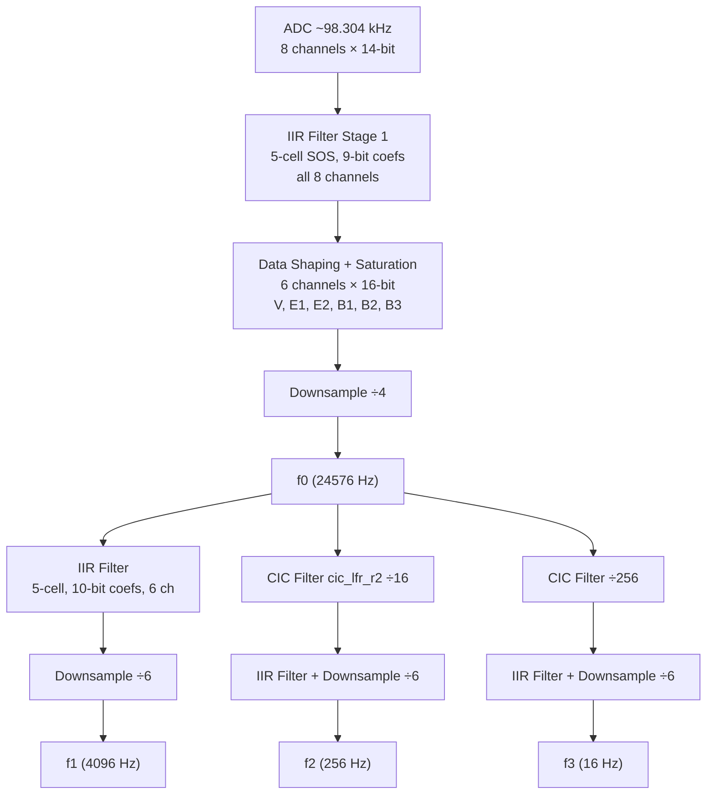
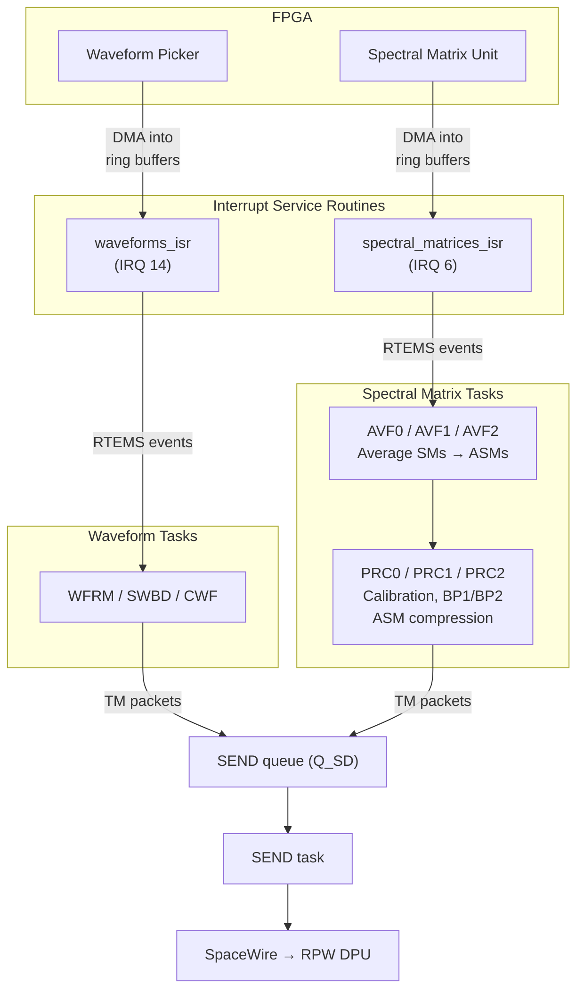
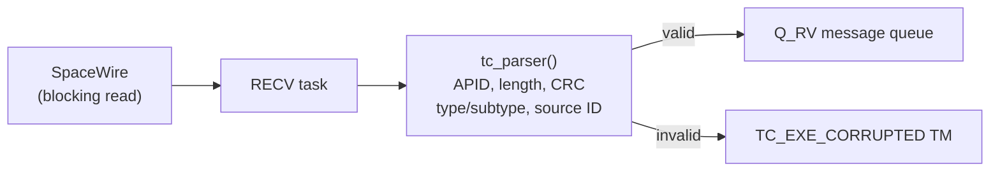

# LFR Flight Software Architecture

This document provides a comprehensive technical description of the Low Frequency Receiver (LFR) flight software for the Solar Orbiter mission. It is intended for developers, scientists, and engineers who need to understand, modify, or extend the software.

## Table of Contents

- [Overview](#overview)
- [Hardware Platform](#hardware-platform)
- [Build System](#build-system)
- [Directory Structure](#directory-structure)
- [Boot and Initialization Sequence](#boot-and-initialization-sequence)
- [RTEMS Task Architecture](#rtems-task-architecture)
- [FPGA Digital Filter Chain](#fpga-digital-filter-chain)
- [Data Acquisition and Flow](#data-acquisition-and-flow)
- [Spectral Matrix Processing](#spectral-matrix-processing)
- [Basic Parameters Computation](#basic-parameters-computation)
- [Waveform Handling](#waveform-handling)
- [Telecommand Handling](#telecommand-handling)
- [Telemetry Generation](#telemetry-generation)
- [SpaceWire Communication](#spacewire-communication)
- [Calibration](#calibration)
- [Mitigation Filters](#mitigation-filters)
- [Housekeeping](#housekeeping)
- [Watchdog](#watchdog)
- [Operating Modes](#operating-modes)
- [Ring Buffer Architecture](#ring-buffer-architecture)
- [Memory-Mapped Hardware Registers](#memory-mapped-hardware-registers)
- [Test Infrastructure](#test-infrastructure)
- [Key Constants and Parameters](#key-constants-and-parameters)

---

## Overview

The LFR FSW runs on a LEON3-FT (fault-tolerant) soft-core CPU implemented in an RTAX-4000D FPGA. It uses **RTEMS 4.10** as its real-time operating system. The CPU runs at 25 MHz; most heavy computation (digital filtering, FFT, spectral matrix generation) is offloaded to custom FPGA logic. The FSW handles:

- Spectral matrix averaging, compression, and calibration
- Basic parameter (BP1/BP2) computation from averaged spectral matrices
- Waveform snapshot and continuous waveform management
- Telecommand reception, validation, and execution
- Telemetry packet construction and transmission over SpaceWire
- Housekeeping data collection and reporting
- Hardware watchdog management
- Interference mitigation (reaction wheel filtering, PAS filtering)

The software communicates with the RPW DPU (Data Processing Unit) over a SpaceWire link using the CCSDS packet protocol.

## Hardware Platform

| Component | Details |
|-----------|---------|
| CPU | LEON3-FT @ 25 MHz (SPARC V8), FPU enabled |
| FPGA | RTAX-4000D (FM board ID `0x03`) |
| RTOS | RTEMS 4.10 |
| SRAM | 2 × 512K×32-bit chips, 19-bit address, EDAC enabled (SRBANKSZ=8) |
| ADC | RHF1401, 9 channels × 14-bit, sampled at ~98.304 kHz (clk_24 / 250) |
| SpaceWire | GRSPW, 2 ports, 10 MHz link rate, RMAP enabled (pirq=11) |
| Timers | GPTIMER (GRLIB) |
| UART | APBUART @ 115200 baud |

### Clock Architecture

The FPGA has two independent clock domains:

| Clock | Source | Frequency | Domain |
|-------|--------|-----------|--------|
| **clk_25** | 50 MHz oscillator ÷ 2 | 25 MHz | CPU, AHB/APB bus, all digital logic |
| **clk_24** | 49.152 MHz oscillator ÷ 2 | 24.576 MHz | ADC sampling, digital filter chain |

The 24.576 MHz clock is chosen so that integer decimation ratios produce exact sampling rates: 24576 Hz (f0), 4096 Hz (f1), 256 Hz (f2), 16 Hz (f3).

### Board Variants

| ID | Board | FPGA |
|----|-------|------|
| `0x00` | Mini-LFR | A3PE3000 |
| `0x01` | LFR EM | A3PE3000 |
| `0x02` | LFR EQM | A3PE3000 |
| `0x03` | LFR FM (flight) | RTAX4000D |
| `0x04` | DiscoSpace | A3PE3000 |

### FPGA IP Cores

The FPGA SoC includes custom IP cores for:
- **Waveform Picker** -- DMA engine that acquires waveform samples at four frequency channels (f0, f1, f2, f3) into CPU memory via double-buffered ring nodes
- **Spectral Matrix unit** -- 256-point Hanning-windowed FFT (Actel CoreFFT IP) + hardware cross-correlation, writing 5×5 Hermitian matrices via DMA
- **Digital Filter Chain** (`lpp_lfr_filter`) -- IIR + CIC decimation filters producing f0/f1/f2/f3 from the ADC sample stream
- **Time Management** (`apb_lfr_management`) -- maintains coarse/fine time synchronized to SpaceWire timecodes
- **Calibration DAC** -- generates calibration signals
- **ADC Interface** (`top_ad_conv_RHF1401_withFilter`) -- drives the 9-channel RHF1401 ADC with anti-aliasing

### APB Register Map

| Peripheral | APB Index | Base Address | Notes |
|-----------|-----------|-------------|-------|
| APBUART | 1 | `0x80000100` | pirq=2 |
| IRQMP | 2 | `0x80000200` | Interrupt controller |
| GPTIMER | 3 | `0x80000300` | pirq=8, 2 timers |
| GRSPW | 5 | `0x80000500` | pirq=11, 2 ports, RMAP |
| Time Management | 6 | `0x80000600` | `apb_lfr_management` |
| LFR (top) | 15 | `0x80000f00` | 4 KB space, pirq_ms=6, pirq_wfp=14 |
| — Spectral Matrix | — | `0x80000f00` | Within LFR register space |
| — Waveform Picker | — | `0x80000f54` | Within LFR register space |
| — VHDL Version | — | `0x80000ff0` | Read-only board/version ID |

### AHB Masters

| Index | Master | Notes |
|-------|--------|-------|
| 0 | LEON3-FT CPU | Instruction + data |
| 1 | GRSPW | SpaceWire DMA |
| 2 | LFR DMA subsystem | Waveform + Spectral Matrix DMA (5 FIFO channels, round-robin arbiter) |

### IRQ Lines

| IRQ | SPARC Trap | Source |
|-----|-----------|--------|
| 6 | `0x16` | Spectral Matrix unit |
| 9 | `0x19` | GPTIMER Watchdog |
| 14 | `0x1e` | Waveform Picker |

## Build System

The project uses **Meson** as its build system with a SPARC cross-compilation toolchain (RTEMS 4.10).

### Cross-build (flight binary)

```bash
meson setup -Dlpp-destid=false -Doptimization=s --cross-file=sparc-cross.ini . build
cd build && ninja
```

This produces:
- `fsw` -- ELF binary
- `RpwLfrApp_XXXX_text_rev-X-X-X-X.srec` -- text section in SREC format (for upload)
- `RpwLfrApp_XXXX_data_rev-X-X-X-X.srec` -- data section in SREC format
- `fsw.S` -- full disassembly dump
- `check_b2bst.log` -- LEON3-FT B2BST errata scan results

### Native build (tests only)

```bash
meson setup . build-native
cd build-native && ninja test
```

### Build Options

| Option | Default | Description |
|--------|---------|-------------|
| `SW_VERSION_N1..N4` | `3.3.0.16` | Software version number |
| `fix-b2bst` | `true` | Mitigate LEON3-FT stale cache errata (GRLIB-TN-0009) |
| `lpp-destid` | `false` | Use LPP lab DPU destination ID instead of flight ID |
| `with-gcov` | `false` | Enable code coverage instrumentation |
| `enable-printf` | `false` | Enable console debug output |
| `enable-boot-messages` | `false` | Enable boot-time messages |
| `enable-cpu-usage-report` | `false` | Enable RTEMS CPU usage statistics |
| `enable-stack-report` | `false` | Enable RTEMS stack usage checker |

### Cross-Compilation Toolchain

Defined in `sparc-cross.ini`:
- Toolchain path: `/opt/rtems-4.10/`
- Target triple: `sparc-rtems`
- Endianness: big-endian

A Docker image for the build environment is available at [jeandet/teamcity-docker-SolarOrbiter-LFR-agent](https://github.com/jeandet/teamcity-docker-SolarOrbiter-LFR-agent/tree/master).

## Directory Structure

```
LFR_Flight_Software/
+-- src/                          Main flight software sources
|   +-- fsw_init.c                RTEMS init task, boot sequence
|   +-- fsw_globals.c             Global variable definitions
|   +-- fsw_config.c              RTEMS configuration tables
|   +-- fsw_spacewire.c           SpaceWire tasks (RECV, SEND, SPIQ, LINK)
|   +-- fsw_misc.c                Utility tasks (LOAD, HOUS, AVGV, SCRB, CALI, DUMB)
|   +-- fsw_housekeeping.c        HK packet initialization and data collection
|   +-- fsw_watchdog.c            Watchdog ISR and configuration
|   +-- fsw_processing_globals.c  Processing-related global state
|   +-- lfr_cpu_usage_report.c    CPU usage reporting
|   +-- hw/
|   |   +-- wf_handler.c          Waveform ISR, ring buffer management, WF tasks
|   |   +-- timer.c               GPTIMER configuration
|   |   +-- uart.c                UART helper functions
|   +-- tc_tm/
|   |   +-- tc_handler.c          TC action task and all TC action handlers
|   |   +-- tc_acceptance.c       TC parsing and validation
|   |   +-- tc_load_dump_parameters.c  Parameter load/dump TC implementation
|   |   +-- tm_lfr_tc_exe.c       TC execution report TM generation
|   +-- processing/
|   |   +-- fsw_processing.c      Common processing utilities
|   |   +-- avf0_prc0.c           F0 spectral matrix averaging (AVF0) and processing (PRC0)
|   |   +-- avf1_prc1.c           F1 spectral matrix averaging (AVF1) and processing (PRC1)
|   |   +-- avf2_prc2.c           F2 spectral matrix averaging (AVF2) and processing (PRC2)
|   |   +-- calibration_matrices.c Pre-computed calibration matrix tables
|   |   +-- ASM/spectralmatrices.c Spectral matrix averaging, compression, calibration
|   +-- mitigations/
|       +-- PAS_filtering.c       Periodic Acquisition Scheme time-domain filtering
|       +-- reaction_wheel_filtering.c  Reaction wheel frequency bin masking
+-- header/                       All header files (mirrors src/ structure)
|   +-- lfr_common_headers/
|   |   +-- fsw_params.h          Master config: RTEMS params, modes, task IDs/priorities
|   |   +-- fsw_params_processing.h  Spectral matrix dimensions and bin counts
|   |   +-- fsw_params_nb_bytes.h Packet size definitions
|   |   +-- ccsds_types.h         CCSDS packet structures and protocol constants
|   |   +-- tm_byte_positions.h   TM packet field byte offsets
|   +-- hw/
|   |   +-- lfr_regs.h            Memory-mapped register structures (WFP, SM, timers)
|   +-- processing/
|   |   +-- ASM/spectralmatrices.h
|   |   +-- calibration_matrices.h
|   |   +-- iir_filter.h          IIR filter for V/E field averaging
|   +-- mitigations/
|       +-- PAS_filtering.h
|       +-- reaction_wheel_filtering.h
+-- LFR_basic-parameters/         Basic parameter computation library
|   +-- basic_parameters.c        BP1 and BP2 computation from spectral matrices
|   +-- basic_parameters.h        Public API: compute_BP1(), compute_BP2()
|   +-- basic_parameters_params.h BP byte layout and encoding constants
|   +-- custom_floats.h           Custom float encoding for telemetry
|   +-- file_utilities.c          Test file I/O helpers
+-- tests/                        Native test suite (Catch2)
+-- testbenches/                   Performance benchmarks
|   +-- optimization/ASM/         ASM processing benchmark
|   +-- optimization/BasicParameters1/  BP computation benchmark
+-- sparc/                        LEON3-FT B2BST errata scan tools
+-- EQM/                          Engineering Qualification Model specific code
+-- libgcov/                      Custom gcov runtime for RTEMS cross-compilation
+-- python_scripts/               Call graph generation tools
+-- pictures/                     Documentation images
+-- doc/                          Legacy documentation (Doxygen, Word docs)
+-- docs/                         Additional documentation
```

## Boot and Initialization Sequence

The boot sequence is implemented in `src/fsw_init.c`, in the RTEMS `Init` task (priority 1, non-preemptible):

1. **Reset LFR hardware** -- `reset_lfr()` performs a soft reset of the waveform picker and spectral matrix FPGA cores
2. **Reset local time** -- forces coarse time to `0x80000000` (unsynchronized flag)
3. **Configure UART** -- enables transmitter at 115200 baud
4. **Initialize CPU cache** -- enables instruction cache, data cache, instruction burst fetch, and fault-tolerant scheme
5. **Initialize parameters** -- loads default values for parameter dump, k-coefficients, mode parameters, housekeeping, and filter parameters
6. **Initialize reaction wheel frequencies** -- sets all 16 RW frequency slots to NaN
7. **Initialize waveform picker** -- creates ring buffers for f0/f1/f2/f3, resets DMA pointers
8. **Initialize spectral matrix unit** -- creates ring buffers for SM f0/f1/f2, resets DMA pointers
9. **Configure calibration** -- loads default calibration matrices from compiled tables
10. **Set mode to STANDBY**
11. **Create RTEMS objects** -- names, timecode timer, 5 message queues, 22 tasks
12. **Initialize SpaceWire** -- open, configure, and start the GRSPW link
13. **Start all tasks** -- first non-SpW tasks, then RECV and SEND tasks
14. **Suspend science tasks** -- they will be resumed when a mode-change TC is received
15. **Install ISRs** -- `waveforms_isr` on IRQ 14, `spectral_matrices_isr` on IRQ 6
16. **Start timecode timer** -- detects missing SpaceWire timecodes (2.0s initial timeout)
17. **Delete Init task** -- frees its resources

## RTEMS Task Architecture

The FSW runs 22 concurrent RTEMS tasks. Lower priority numbers = higher priority.

### SpaceWire Communication Tasks

| Task | Priority | Description |
|------|----------|-------------|
| **SPIQ** | 5 | SpaceWire interrupt handler -- wakes on link error events, performs link recovery (suspend RECV/SEND, reconnect, restart) |
| **LINK** | 20 | SpaceWire link monitor -- periodically checks link status, attempts reconnection |
| **RECV** | 50 | TC receiver -- blocking read on SpaceWire, validates packets via `tc_parser()`, forwards valid TCs to ACTN via message queue |
| **SEND** | 45 | TM transmitter -- reads from send queue, writes packets over SpaceWire |
| **ACTN** | 50 | TC action executor -- receives validated TCs from RECV queue, dispatches to action handlers based on subtype |

### Science Processing Tasks (per frequency channel)

For each frequency channel Fx (x = 0, 1, 2):

| Task | Priority | Description |
|------|----------|-------------|
| **AVFx** | 60/70/110 | Spectral matrix averaging -- triggered by SM ISR events, accumulates SMs into averaged SM (ASM) ring buffers, sends ASM messages to PRCx when averaging periods complete |
| **PRCx** | 100/100/110 | ASM processing -- applies calibration, computes BP1/BP2, compresses ASMs, builds TM packets, sends to SEND queue |

### Waveform Tasks

| Task | Priority | Description |
|------|----------|-------------|
| **WFRM** | 40 | Waveform snapshot handler for f0 -- triggered by WFP ISR, builds SWF TM packets |
| **SWBD** | 37 | Snapshot extraction for f1/f2 -- extracts aligned snapshots from continuous acquisition buffers |
| **CWF1** | 35 | Continuous waveform f1 -- sends CWF packets in SBM1 mode |
| **CWF2** | 35 | Continuous waveform f2 -- sends CWF packets in SBM2 mode |
| **CWF3** | 40 | Continuous waveform f3 -- sends light CWF packets (3 components instead of 6) |

### Housekeeping and System Tasks

| Task | Priority | Description |
|------|----------|-------------|
| **AVGV** | 25 | Analog voltage averaging -- runs at 60ms period, IIR-filters V, E1, E2 from waveform picker registers |
| **HOUS** | 30 | Housekeeping -- runs at 1s period, collects system status, builds and sends HK TM packets |
| **LOAD** | 190 | Watchdog feeder -- runs at 1s period, reloads hardware watchdog timer |
| **CALI** | 50 | Calibration sweep -- waits for calibration enable TC, manages calibration signal generation |
| **SCRB** | 210 | Memory scrubbing -- lowest priority background task for radiation-induced error mitigation |
| **DUMB** | 200 | Debug/diagnostic task (conditionally compiled) |

### Message Queues

| Queue | Capacity | Message Size | Purpose |
|-------|----------|-------------|---------|
| Q_RV | 10 | 232 bytes | Valid TCs from RECV to ACTN |
| Q_SD | 50 | 812 bytes | TM packets from any task to SEND |
| Q_P0 | 10 | `sizeof(asm_msg)` | Averaged SM from AVF0 to PRC0 |
| Q_P1 | 10 | `sizeof(asm_msg)` | Averaged SM from AVF1 to PRC1 |
| Q_P2 | 5 | `sizeof(asm_msg)` | Averaged SM from AVF2 to PRC2 |

### Interrupt Service Routines

| ISR | IRQ | Function |
|-----|-----|----------|
| `waveforms_isr` | 14 (SPARC `0x1e`) | Handles waveform picker buffer-full interrupts for f0-f3, advances ring buffer pointers, sends RTEMS events to WFRM/CWF/SWBD tasks |
| `spectral_matrices_isr` | 6 (SPARC `0x16`) | Handles SM buffer-full interrupts for f0-f2, advances ring buffer pointers, sends RTEMS events to AVF0/AVF1/AVF2 tasks |
| `watchdog_isr` | 9 (SPARC `0x19`) | Should never fire -- calls `exit(0)` if watchdog expires |
| `timecode_irq_handler` | (callback) | SpaceWire timecode reception callback -- synchronizes local time, detects timecode sequence errors |

## FPGA Digital Filter Chain

The filter chain (`lpp_lfr_filter`) transforms the raw ADC samples into four frequency bands. It operates in the 24.576 MHz clock domain.

### Input Stage

The RHF1401 ADC provides 8 analog channels (5 E-field + 3 B-field) as 14-bit samples at ~98.304 kHz (clk_24 / 250). The ADC interface (`top_ad_conv_RHF1401_withFilter`) manages channel multiplexing and optional per-channel digital filtering.

The 8 raw channels are mapped to 6 output channels per frequency band:

| Output Channel | Content | Notes |
|---------------|---------|-------|
| V | Voltage (E-field derived) | Data-shaped from E-field channels |
| E1 | Electric field 1 | AC or DC coupled (R0/R1/R2 select) |
| E2 | Electric field 2 | AC or DC coupled (R0/R1/R2 select) |
| B1 | Magnetic field 1 | Search coil |
| B2 | Magnetic field 2 | Search coil |
| B3 | Magnetic field 3 | Search coil |

### Data Shaping

Before decimation, optional data shaping is applied via the `data_shaping` register in the Waveform Picker:

- **SP0**: differential mode, computes f1 − f0 (channel subtraction) with saturation
- **SP1**: differential mode, computes f2 − f1 (channel subtraction) with saturation
- **R0, R1, R2**: select AC-coupled (channels 1,2) vs DC-coupled (channels 3,4) E-field inputs
- **BW**: bandwidth selection

### Decimation Chain



### IIR Filter Topology

Each IIR stage is a cascade of 5 second-order sections (biquads). The SOS coefficients are stored as fixed-point values (9-bit or 10-bit depending on stage) with configurable fractional width. These are Butterworth-like low-pass filters designed to prevent aliasing before each decimation step.

### CIC Filter Topology

The CIC (Cascaded Integrator-Comb) filters use 3 integrator stages → decimator → 3 comb stages, with delay D=2. Data grows by 5 bits during integration and is normalized back to 16-bit after the comb section. Two CIC instances produce intermediate rates of ÷16 and ÷256 from f0.

## Data Acquisition and Flow

LFR measures 8 raw analog channels: 5 electric field (E0--E4) and 3 magnetic field (B0--B2) components via a 14-bit ADC (RHF1401) at ~98.304 kHz. After filtering and data shaping, 6 output channels (V, E1, E2, B1, B2, B3) are produced at four frequency bands:

| Channel | Sampling Rate | Decimation from f0 | Source |
|---------|--------------|---------------------|--------|
| **f0** | 24576 Hz | -- | IIR + ÷4 from ADC rate |
| **f1** | 4096 Hz | ÷6 | IIR on f0 + ÷6 |
| **f2** | 256 Hz | ÷96 (CIC ÷16 + ÷6) | CIC on f0 + IIR + ÷6 |
| **f3** | 16 Hz | ÷1536 (CIC ÷256 + ÷6) | CIC on f0 + IIR + ÷6 |

### Data Products

The FPGA produces two types of data products per frequency channel:

1. **Waveform snapshots (SWF)** -- time-domain samples, 2688 samples per snapshot (6 channels × 16-bit packed as 3 × 32-bit words per sample)
2. **Spectral matrices (SM)** -- the FPGA applies a 256-point Hanning window followed by a 256-point FFT (Actel CoreFFT IP, real input / complex output) on each of 5 components (E1, E2, B1, B2, B3 -- V excluded), then computes the 5×5 cross-spectral matrix via hardware correlation. This yields 128 useful frequency bins × 25 float values (5 auto-spectra + 10 complex cross-spectra)

Both are written to CPU memory via DMA into double-buffered ring nodes.

### High-Level Data Flow



## Spectral Matrix Processing

### Overview

The FPGA spectral matrix unit (`lpp_lfr_ms`) processes f0, f1, and f2 samples through a shared pipeline:

1. **Input buffering** -- 5-component samples (E1, E2, B1, B2, B3) are stored in double-buffered FIFOs (A/B ping-pong for f0, single FIFO for f1/f2). Each FIFO holds 256 samples × 5 channels × 16-bit.
2. **Channel multiplexing** -- an FSM (`fsm_select_channel`) round-robins between f0_A, f0_B, f1, f2, feeding one component at a time to the FFT.
3. **Windowing** -- a 256-point Hanning window (`window_function` component, 15-bit parameter ROM) is applied to each component.
4. **FFT** -- Actel/Microsemi CoreFFT IP computes a 256-point real-to-complex FFT (16-bit input → 16-bit real + 16-bit imaginary output).
5. **Cross-correlation** -- the hardware multiplier-accumulator computes all 25 unique elements of the 5×5 Hermitian matrix: 5 auto-spectra (Re×Re + Im×Im) and 10 complex cross-spectra (conjugate products).
6. **DMA output** -- completed matrices are written to CPU memory via the DMA subsystem (AHB master, 16-word bursts).

Each spectral matrix (SM) contains 25 real values per frequency bin (5 auto-spectra + 10 complex cross-spectra = 5 + 20 = 25). With 128 bins, the total size is `128 * 25 = 3200 floats`.

The 25 components are indexed as:

| Index | Component | Type |
|-------|-----------|------|
| 0 | B1B1 | Auto-spectrum |
| 1, 2 | B1B2 real, imag | Cross-spectrum |
| 3, 4 | B1B3 real, imag | Cross-spectrum |
| 5, 6 | B1E1 real, imag | Cross-spectrum |
| 7, 8 | B1E2 real, imag | Cross-spectrum |
| 9 | B2B2 | Auto-spectrum |
| 10, 11 | B2B3 real, imag | Cross-spectrum |
| 12, 13 | B2E1 real, imag | Cross-spectrum |
| 14, 15 | B2E2 real, imag | Cross-spectrum |
| 16 | B3B3 | Auto-spectrum |
| 17, 18 | B3E1 real, imag | Cross-spectrum |
| 19, 20 | B3E2 real, imag | Cross-spectrum |
| 21 | E1E1 | Auto-spectrum |
| 22, 23 | E1E2 real, imag | Cross-spectrum |
| 24 | E2E2 | Auto-spectrum |

### Averaging Pipeline (AVFx tasks)

The FPGA generates 96 SMs/s at f0, 16 SMs/s at f1, and 1 SM/s at f2. The AVFx tasks accumulate these into Averaged Spectral Matrices (ASMs):

1. **AVF0** averages 8 SMs at a time (triggered every 8 new f0 SMs)
2. **AVF1** averages 8 SMs at a time (triggered every 8 new f1 SMs)
3. **AVF2** processes 1 SM at a time

Two parallel averaging tracks run simultaneously:
- **NORM track** -- long-period averaging for Normal mode (period configurable, default 4s for BP1)
- **BURST/SBM track** -- short-period averaging for Burst/SBM modes (period configurable, default 1s)

When an averaging period completes, an `asm_msg` is posted to the PRCx queue containing pointers to the completed ASM ring node.

### Processing Pipeline (PRCx tasks)

Upon receiving an `asm_msg`, the PRCx task:

1. **Applies calibration** -- multiplies the ASM by pre-computed calibration matrices (corrects antenna misalignment, frequency response)
2. **Computes Basic Parameters** -- calls `compute_BP1()` and `compute_BP2()` on the calibrated ASM
3. **Compresses the ASM** -- averages groups of frequency bins (8 bins into 1 for NORM, 4 for SBM) to reduce data volume
4. **Builds TM packets** -- packages BP1, BP2, and compressed ASM data into CCSDS TM packets
5. **Sends to Q_SD** -- posts packets to the send queue for transmission

### Frequency Bin Selection

Not all 128 bins are used; the useful range depends on the channel:

| Channel | Start Bin | Bins Kept | Compressed Bins (NORM) | Compressed Bins (SBM) |
|---------|-----------|-----------|----------------------|---------------------|
| f0 | 16 | 88 | 11 | 22 |
| f1 | 5 | 104 | 13 | 26 |
| f2 | 6 | 96 | 12 | -- |

## Basic Parameters Computation

Basic Parameters are reduced representations of the spectral matrices, computed in `LFR_basic-parameters/basic_parameters.c`.

### BP1 (Basic Parameters set 1)

Computed by `compute_BP1()` from compressed spectral matrices. For each frequency bin, BP1 contains:
- **PSDB** -- Magnetic power spectral density (B1B1 + B2B2 + B3B3)
- **PSDE** -- Electric power spectral density (E1E1 + E2E2)
- **Ellipticity** -- derived from the magnetic spectral matrix eigenvalues
- **Degree of polarization** -- coherence of the wave magnetic field
- **Normal vector direction** (theta, phi) -- wave propagation direction
- **Poynting flux direction** (theta, phi) -- energy flow direction
- **VPHI** -- phase velocity estimate

All values are encoded in compact formats (custom floats, 8-bit angles) for efficient telemetry.

### BP2 (Basic Parameters set 2)

Computed by `compute_BP2()`. Contains the full compressed cross-spectral matrix components, allowing ground reconstruction of the spectral matrix at reduced frequency resolution.

## Waveform Handling

### Ring Buffer Architecture

Each frequency channel has a ring of DMA buffers (double or triple buffered). The FPGA writes waveform data via DMA into one buffer while the CPU reads from another:

| Channel | Ring Nodes | Samples per Snapshot |
|---------|-----------|---------------------|
| f0 | 3 | 2688 |
| f1 | 5 | 2688 |
| f2 | 5 | 2688 |
| f3 | 3 | 2688 |

Each sample block contains 6 channels × 16-bit = 96 bits, packed as 3 × 32-bit words in memory:
- Word 0: `[E1(15:0) | V(15:0)]`
- Word 1: `[B1(15:0) | E2(15:0)]`
- Word 2: `[B3(15:0) | B2(15:0)]`

### Waveform Products

| Product | Description | Task |
|---------|-------------|------|
| **SWF** (Snapshot Waveform) | Periodic snapshots at configurable intervals. f0 snapshots directly from the ring buffer, f1/f2 extracted and aligned by SWBD | WFRM, SWBD |
| **CWF** (Continuous Waveform) | Continuous data stream in burst/SBM modes | CWF1, CWF2, CWF3 |
| **CWF3 light** | f3 continuous waveform with only 3 components (B1, B2, B3) to save bandwidth | CWF3 |

### Snapshot Resynchronization

f1 and f2 snapshots are derived from continuous acquisition buffers. The SWBD task extracts 2688-sample windows aligned with the f0 snapshot time. A state machine (`resynchro_state_t`: MEASURE/CORRECTION) handles timing corrections when clock drift is detected.

## Telecommand Handling

### Reception Path



### TC Subtypes and Actions

| Subtype | Name | Handler | Description |
|---------|------|---------|-------------|
| 1 | RESET | `action_reset()` | Software reset (calls `exit(0)`) |
| 11 | LOAD_COMM | `action_load_common_par()` | Load common parameters |
| 13 | LOAD_NORM | `action_load_normal_par()` | Load Normal mode parameters (SWF period, BP periods, ASM period) |
| 19 | LOAD_BURST | `action_load_burst_par()` | Load Burst mode parameters |
| 25 | LOAD_SBM1 | `action_load_sbm1_par()` | Load SBM1 mode parameters |
| 27 | LOAD_SBM2 | `action_load_sbm2_par()` | Load SBM2 mode parameters |
| 31 | DUMP | `action_dump_par()` | Dump current parameters as TM |
| 41 | ENTER | `action_enter_mode()` | Enter a new operating mode |
| 51 | UPDT_INFO | `action_update_info()` | Update spacecraft info (time, orbit) |
| 61 | EN_CAL | `action_enable_calibration()` | Enable calibration signal |
| 63 | DIS_CAL | `action_disable_calibration()` | Disable calibration signal |
| 71 | LOAD_K | `action_load_kcoefficients()` | Load k-coefficients for BP computation |
| 73 | DUMP_K | `action_dump_kcoefficients()` | Dump k-coefficients as TM |
| 75 | LOAD_FBINS | `action_load_fbins_mask()` | Load frequency bin masks |
| 77 | LOAD_FILTER_PAR | `action_load_filter_par()` | Load PAS/RW filter parameters |
| 9/129 | UPDT_TIME | `action_update_time()` | Update onboard time |

Each action handler sends a TC execution report (success or error with specific error code) via the SEND queue.

## Telemetry Generation

TM packets follow the CCSDS space packet protocol with a SpaceWire transport layer header.

### TM Packet Types

| APID | Category | Description |
|------|----------|-------------|
| `0x0CC1` | 1 | TC execution reports |
| `0x0CC4` | 4 | Housekeeping |
| `0x0CC6` | 6 | Parameter dumps |
| `0x0CCC` | 12 | Science data (Normal/Burst) |
| `0x0CFC` | 12 | Science data (SBM1/SBM2) |

### Science TM Products

| Product | Content | Frequency |
|---------|---------|-----------|
| TM_LFR_SCIENCE_NORMAL_SWF_Fx | Snapshot waveforms | Configurable (default 300s) |
| TM_LFR_SCIENCE_NORMAL_CWF_F3 | Continuous waveform f3 (light) | Continuous |
| TM_LFR_SCIENCE_NORMAL_BP1_Fx | Basic Parameters set 1 | Configurable (default 4s) |
| TM_LFR_SCIENCE_NORMAL_BP2_Fx | Basic Parameters set 2 | Configurable (default 20s) |
| TM_LFR_SCIENCE_NORMAL_ASM_Fx | Averaged Spectral Matrices | Configurable (default 3600s) |
| TM_LFR_SCIENCE_BURST_BP1_Fx | BP1 in Burst mode | 1s |
| TM_LFR_SCIENCE_BURST_BP2_Fx | BP2 in Burst mode | 5s |
| TM_LFR_SCIENCE_SBM_CWF_Fx | CWF in SBM modes | Continuous |

## SpaceWire Communication

### Hardware

The GRSPW IP core (GRLIB) is instantiated with:
- **2 ports** (redundant hot/cold)
- **10 MHz link rate** (50 MHz system clock ÷ 5)
- **RMAP enabled** (Remote Memory Access Protocol for register-level access)
- **AHB master index 1**, APB slave at pindex=5, paddr=5
- **IRQ 11** (SPARC trap `0x1b`)

### Link Management

The GRSPW IP core is accessed via the RTEMS device `/dev/grspw0`. Link management involves:

1. **LINK task** -- monitors link health, waits for `RTEMS_EVENT_0` to trigger reconnection attempts
2. **SPIQ task** -- highest-priority handler for SpaceWire link errors:
   - Suspends RECV and SEND
   - Checks link status via `ioctl(SPACEWIRE_IOCTRL_GET_LINK_STATUS)`
   - Attempts reconnection up to `SY_LFR_DPU_CONNECT_ATTEMPT` (3) times
   - On success: restarts RECV and SEND tasks
   - On failure: enters STANDBY mode and delegates to LINK task

### Timecode Handling

SpaceWire timecodes synchronize the onboard clock:
- `timecode_irq_handler` is registered as the GRSPW timecode callback
- A timer (`timecode_timer_id`) fires after 1.2s if no timecode is received, triggering recovery
- Timecode sequence errors are detected and reported in housekeeping

### DPU Connection

- Destination ID: `0x01` (flight) or `32` (LPP lab, when `lpp-destid` is set)
- Protocol ID: `0x02`
- Connection timeout: 1s per attempt, 3 attempts

## Calibration

### Calibration Matrices

Pre-computed calibration matrices are stored in `src/processing/calibration_matrices.c` as large float arrays. There are separate matrices for magnetic (3x3 complex) and electric (2x2 complex) channels, for each frequency bin of each channel:

| Matrix | Elements per Bin | Bins |
|--------|-----------------|------|
| Magnetic f0 | 18 floats (3x3 complex) | 89 |
| Electric f0 | 8 floats (2x2 complex) | 89 |
| Magnetic f1 | 18 floats | 105 |
| Electric f1 | 8 floats | 105 |
| Magnetic f2 | 18 floats | 97 |
| Electric f2 | 8 floats | 97 |

These matrices correct for:
- Antenna misalignment between B-field search coils
- Antenna misalignment between E-field probes
- Frequency-dependent transfer functions
- AC/DC coupling effects

Calibration is applied in the PRCx tasks after averaging, before BP computation and ASM compression.

### Calibration Signal

A hardware calibration DAC can inject known signals for in-flight calibration. The CALI task manages the calibration sweep sequence, controlled via `TC_LFR_ENABLE_CALIBRATION` and `TC_LFR_DISABLE_CALIBRATION` telecommands.

## Mitigation Filters

### PAS Filtering (Periodic Acquisition Scheme)

Implemented in `src/mitigations/PAS_filtering.c`. Detects spectral matrices whose acquisition time overlaps with known periodic interference sources (e.g., spacecraft mechanisms). The `isPolluted()` function tests whether the SM acquisition window [t0, t1] overlaps with a "bad" time window [tbad0, tbad1]:

- `tbad` duration configurable via `SY_LFR_PAS_FILTER_TBAD` (0.0 -- 4.0s)
- Period configurable via `SY_LFR_PAS_FILTER_MODULUS` (4 -- 8 fine-time units)
- Offset and shift also configurable

Polluted matrices are excluded from averaging.

### Reaction Wheel Filtering

Implemented in `src/mitigations/reaction_wheel_filtering.c`. Masks specific frequency bins contaminated by reaction wheel harmonics. Supports 4 reaction wheels, each with 4 frequency harmonics (16 frequency values total). The bin mask is a 128-bit mask per channel merged from:

1. User-uploaded fbins masks (via `TC_SUBTYPE_LOAD_FBINS`)
2. Dynamically computed RW frequency bin masks (using RW frequencies from `TC_SUBTYPE_UPDT_INFO` and configurable k-factors and delta-f)

## Housekeeping

The HOUS task runs every 1 second and collects:

- LFR status word (mode, SpW link state)
- Software and FPGA version numbers
- Onboard temperatures (PCB, FPGA, SCM via ADC in Time Management registers)
- V, E1, E2 analog values (from AVGV task IIR filtering)
- Message queue fill levels (current and max)
- Error counters (SpW link errors, TC rejection counts)
- CPU load statistics (when enabled)

The HK packet is built as a CCSDS TM packet (APID `0x0CC4`) and sent via the SEND queue.

## Watchdog

A hardware watchdog timer (GPTIMER channel 1) is configured with a 10-second timeout:

1. The LOAD task (priority 190) runs a rate-monotonic period of 1s
2. Each period, it reloads the watchdog counter
3. If the LOAD task starves (CPU overload), the watchdog fires `watchdog_isr` which calls `exit(0)`
4. The watchdog can be enabled/disabled, and its status is reported in housekeeping

## Operating Modes

LFR supports 5 operating modes:

| Mode | ID | Description |
|------|-----|-------------|
| **STANDBY** | 0 | No science data acquisition. All science tasks suspended. Default at boot. |
| **NORMAL** | 1 | Nominal science operations. Produces SWF, CWF3-light, BP1/BP2, ASM for all channels. |
| **BURST** | 2 | High-rate burst mode. Produces CWF at f2 rate + BP1/BP2 at higher cadence. |
| **SBM1** | 3 | Selective Burst Mode 1. Produces CWF at f1 rate + normal products. Triggered by onboard event detection. |
| **SBM2** | 4 | Selective Burst Mode 2. Produces CWF at f2 rate + normal products. Triggered by onboard event detection. |

### Mode Transitions

Mode changes are commanded via `TC_SUBTYPE_ENTER` (subtype 41). The `action_enter_mode()` handler:

1. Validates the requested mode transition
2. Stops the current mode (suspends relevant science tasks, resets counters)
3. Reconfigures waveform picker and spectral matrix registers for the new mode
4. Resumes the appropriate science tasks
5. Updates `lfrCurrentMode`

Defined transitions include:
- STANDBY <-> NORMAL
- NORMAL <-> BURST
- NORMAL <-> SBM1
- NORMAL <-> SBM2
- SBM1 <-> SBM2

## Ring Buffer Architecture

The FSW uses circular (ring) buffers extensively for lock-free data transfer from ISR context to task context.

### Ring Node Structure

```c
typedef volatile struct _rg {
    volatile struct _rg* previous;
    volatile struct _rg* next;
    unsigned int coarseTime;
    unsigned int fineTime;
    volatile void* buffer_address;
    unsigned int status;
    unsigned char packet_id;
} ring_node;
```

Each ring is a doubly-linked circular list. The `init_ring()` function distributes a contiguous memory region across all nodes.

### Usage Pattern

1. **ISR** writes new data into the current ring node via DMA, then advances the `current_ring_node` pointer
2. **Task** reads data from ring nodes behind the current pointer
3. The ring must have enough nodes to prevent the writer from overtaking the reader

Ring sizes are chosen to accommodate worst-case processing latencies:
- WF rings: 3-5 nodes
- SM rings: 5-20 nodes (f0 has 20 because 96 SMs/s with 8-SM batch averaging)
- ASM rings: 3-10 nodes

## Memory-Mapped Hardware Registers

### Time Management (`0x80000600`)

```
ctrl               [0x00]  Software reset, time control bits
coarse_time_load   [0x04]  Coarse time load value
coarse_time        [0x08]  Current coarse time (seconds since epoch)
fine_time          [0x0C]  Current fine time (sub-second, 65536 ticks/s)
temp_pcb           [0x10]  PCB temperature ADC
temp_fpga          [0x14]  FPGA temperature ADC
temp_scm           [0x18]  SCM temperature ADC
calDACCtrl         [0x1C]  Calibration DAC control
calPrescaler       [0x20]  Calibration prescaler
calDivisor         [0x24]  Calibration divisor
calDataPtr         [0x28]  Calibration data pointer
calData            [0x2C]  Calibration data register
```

### Waveform Picker (`0x80000f54`)

Double-buffered DMA for 4 frequency channels. Key registers:
- `data_shaping` -- filter configuration (bandwidth, SP0/SP1, R0/R1/R2)
- `run_burst_enable` -- per-channel enable and burst mode control
- `addr_data_fx_y` -- DMA buffer addresses (2 buffers per channel)
- `status` -- buffer-full flags
- `delta_snapshot` -- snapshot period
- `nb_data_by_buffer` -- 2687 (= 2688 - 1)
- `v`, `e1`, `e2` -- instantaneous analog readout registers

### Spectral Matrix (`0x80000f00`)

Double-buffered DMA for 3 frequency channels. Key registers:
- `config` -- IRQ enable bits
- `status` -- buffer-full and error flags
- `fx_y_address` -- DMA buffer addresses
- `fx_y_coarse_time/fine_time` -- acquisition timestamps
- `matrix_length` -- 200 (= 25 * 128 / 16)

## Test Infrastructure

### Native Tests (`tests/`)

Uses Catch2 framework. Tests compile natively (not cross-compiled) with mock RTEMS headers (`tests/common/rtems_mock/rtems.h`). Global state is provided by `tests/common/mock_globals.c`.

### Benchmarks (`testbenches/`)

Performance benchmarks for critical processing paths:
- `testbenches/optimization/ASM/` -- spectral matrix operations
- `testbenches/optimization/BasicParameters1/` -- BP1 computation
- `testbenches/optimization/Memory_write/` -- DMA/memory throughput

### Code Quality

- **cppcheck** integration via Meson `run_target`
- **B2BST scan** -- verifies that the `-mfix-b2bst` compiler flag correctly mitigates the LEON3-FT errata
- **Call graph generation** -- via `python_scripts/cally.sh`
- **gcov** support for code coverage (custom `libgcov` for RTEMS)

## Key Constants and Parameters

### Sampling and Timing

| Constant | Value | Description |
|----------|-------|-------------|
| `NB_SAMPLES_PER_SNAPSHOT` | 2688 | Samples per waveform snapshot |
| `NB_BINS_PER_SM` | 128 | Frequency bins per spectral matrix |
| `NB_FLOATS_PER_SM` | 25 | Float values per bin (5x5 Hermitian) |
| `NB_SM_PER_S_F0` | 96 | Spectral matrices per second at f0 |
| `NB_SM_PER_S_F1` | 16 | Spectral matrices per second at f1 |
| `NB_SM_BEFORE_AVF0_F1` | 8 | SMs accumulated before each AVF step |
| `HK_PERIOD` | 100 | HK period in RTEMS ticks (= 1s) |
| `WATCHDOG_PERIOD` | 100 | Watchdog period in ticks (= 1s) |

### Default Mode Parameters

| Parameter | Default | Description |
|-----------|---------|-------------|
| `SY_LFR_N_SWF_L` | 2048 | Normal mode snapshot length |
| `SY_LFR_N_SWF_P` | 300s | Normal mode snapshot period |
| `SY_LFR_N_ASM_P` | 3600s | Normal mode ASM transmission period |
| `SY_LFR_N_BP_P0` | 4s | Normal mode BP1 period |
| `SY_LFR_N_BP_P1` | 20s | Normal mode BP2 period |
| `SY_LFR_B_BP_P0` | 1s | Burst mode BP1 period |
| `SY_LFR_B_BP_P1` | 5s | Burst mode BP2 period |

### CCSDS Protocol

| Constant | Value | Description |
|----------|-------|-------------|
| `CCSDS_PROCESS_ID` | 76 | LFR process ID |
| `CCSDS_PACKET_CATEGORY` | 12 | Packet category for science |
| `CCSDS_DESTINATION_ID` | 0x01 (flight) | SpW destination |
| `CCSDS_TC_PKT_MAX_SIZE` | 232 | Maximum TC packet size |

---

## Version History

| Version | Date | Notes |
|---------|------|-------|
| 3.2.0.24 | Launch -- 14/03/2023 | Baseline flight software |
| 3.3.0.16 | 14/03/2023 -- present | Bug fixes, calibration matrix support |
