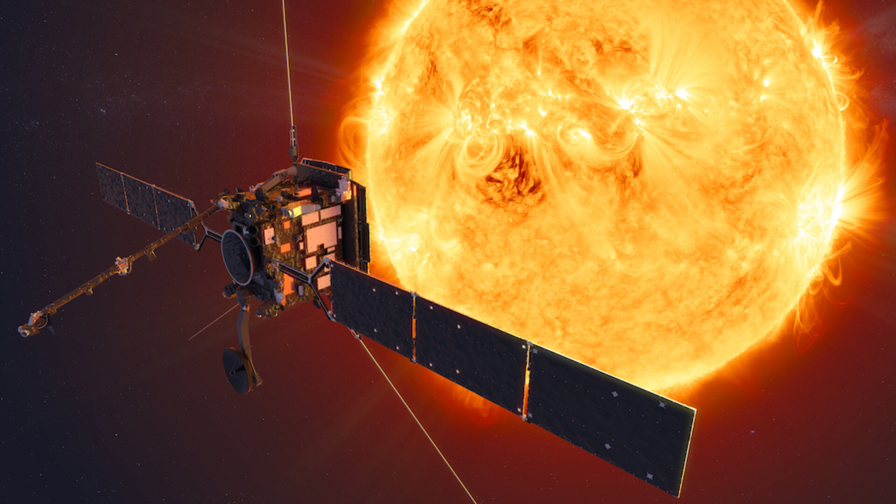
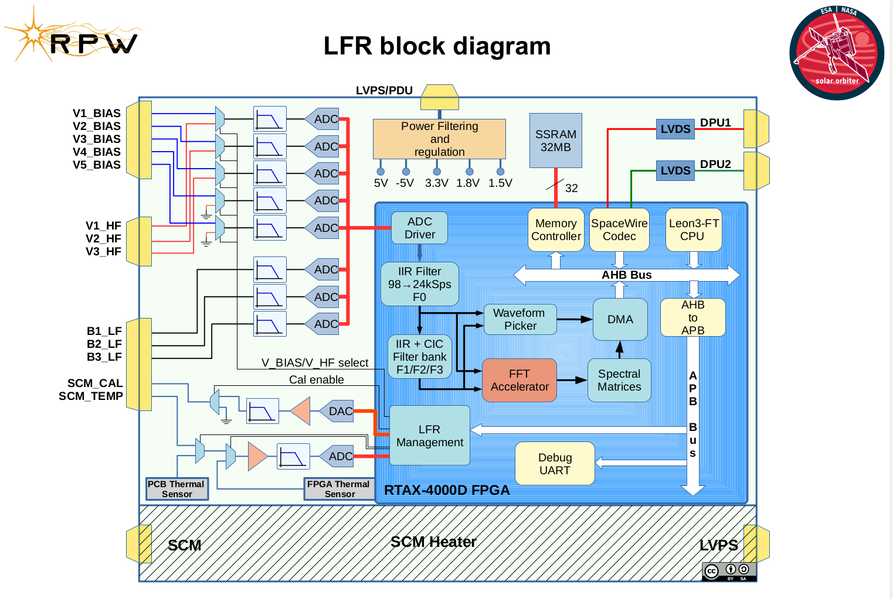
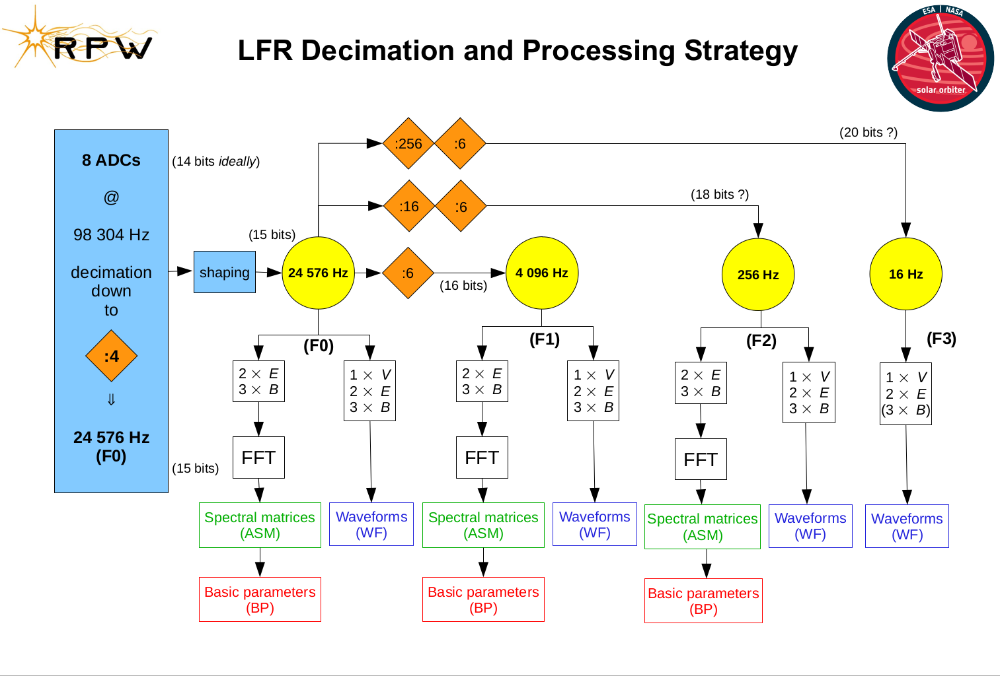

# LFR Flight Software

<div align="center">
    <br/><br/>
    
</div>


Welcome to the Low Frequency Receiver flight software repository for the [Solar Orbiter](https://www.esa.int/Science_Exploration/Space_Science/Solar_Orbiter) probe!

The Solar Orbiter mission, launched in February 2020, aims to study the Sun and its environment in unprecedented detail. 
One of its key instruments is the Radio Plasma Wave instrument where the Low Frequency Receiver (LFR) is a subsystem, which is designed to measure electric and magnetic fields from quasi DC to 10 kHz. 
The LFR will provide crucial information about the solar wind and the Sun's magnetic field, which are important for understanding space weather and its effects on Earth.

This repository contains the flight software for the LFR instrument, which is responsible for controlling the instrument, acquiring data, and transmitting it to [RPW DPU](https://rpw.lesia.obspm.fr/rpw-instrument/). 
The software has been developed by a team of experts in space instrumentation and software engineering, and has undergone rigorous testing and validation to ensure its reliability and performance in the harsh space environment.

We invite you to explore this repository and learn more about the LFR instrument and its flight software. Whether you are a scientist, engineer, or space enthusiast, we hope that this software will inspire you and contribute to our understanding of the Sun and its environment.

## LFR Flight software quick overview

The LFR flight software (FSW) is designed to run on a LEON3-FT CPU which is implemented in an RTAX-4000D FPGA. 
The FSW utilizes RTEMS 4.10 for efficient multitasking between data processing, telemetry handling, and housekeeping. Additionally, the FSW configures and manages our custom System-on-Chip (SoC), enabling the execution of complex computations that are not feasible to implement on a Field-Programmable Gate Array (FPGA).
You can find our RTL code [here](https://github.com/jeandet/VHD_Lib), our specific board top is [here](https://github.com/jeandet/VHD_Lib/blob/master/designs/SOLO_LFR_LFR-FM/LFR-FM.vhd).



The LFR SOC design harnesses the computational power of the RTAX-4000D FPGA to implement a range of digital filters, which enable the production of several aliasing-free data flows. 
For each data flow, the SOC generates waveform snapshots at precise time intervals, performs Fast Fourier Transforms (FFTs), and computes spectral matrices ([see slide 26 in this presentation]((https://presentations.copernicus.org/EGU2020/EGU2020-10050_presentation.pdf))). 
The SOC also leverages our custom [DMA](https://github.com/jeandet/VHD_Lib/tree/master/lib/lpp/lpp_dma) library to write the generated snapshots and spectral matrices directly into CPU memory.

While not explicitly shown in the diagram below, it's worth noting that the CPU operates at a relatively low clock speed of 25MHz.
As a result, the majority of computations are performed inside the FPGA, with only the averaging of Spectral Matrices and computation of Basic Parameters executed on the CPU within the Flight Software. 
This architecture is designed to optimize the computational efficiency of the system while minimizing the workload on the CPU. By offloading as much computational work as possible to the FPGA, which is optimized for high-speed data processing, the system can perform complex computations in real time despite the limitations of the CPU.



### Some LFR sources pointers

- [LFR_basic-parameters/basic_parameters.c](LFR_basic-parameters/basic_parameters.c) contains LFR basic parameters computation code.
- [src/processing/ASM/spectralmatrices.c](src/processing/ASM/spectralmatrices.c) contains LFR Spectral Matrices averaging, compression and calibration code.
- [src/tc_tm/tc_handler.c](src/tc_tm/tc_handler.c) contains LFR Space Wire Telecommands handling.
- [src/hw/wf_handler.c](src/hw/wf_handler.c) contains LFR waveform DMA accelerator related code.

## Building LFR Flight Software

A Docker image is available [here](https://github.com/jeandet/teamcity-docker-SolarOrbiter-LFR-agent/tree/master), which we use to produce binaries that are uploaded to LFR. 
To build the software, run the following commands:

```bash
meson setup -Dlpp-destid=false -Doptimization=s --cross-file=sparc-cross.ini . build
cd build
ninja
```

## History of Flight Software releases:

- 3.2.0.24 Used from launch until 14/03/2023, this is the baseline software
- 3.3.0.16 Used from 14/03/2023 until now. This version fixes a few bugs and introduces calibration matrices used to correct several effects such as E-Field and B-Field antennae misalignment.