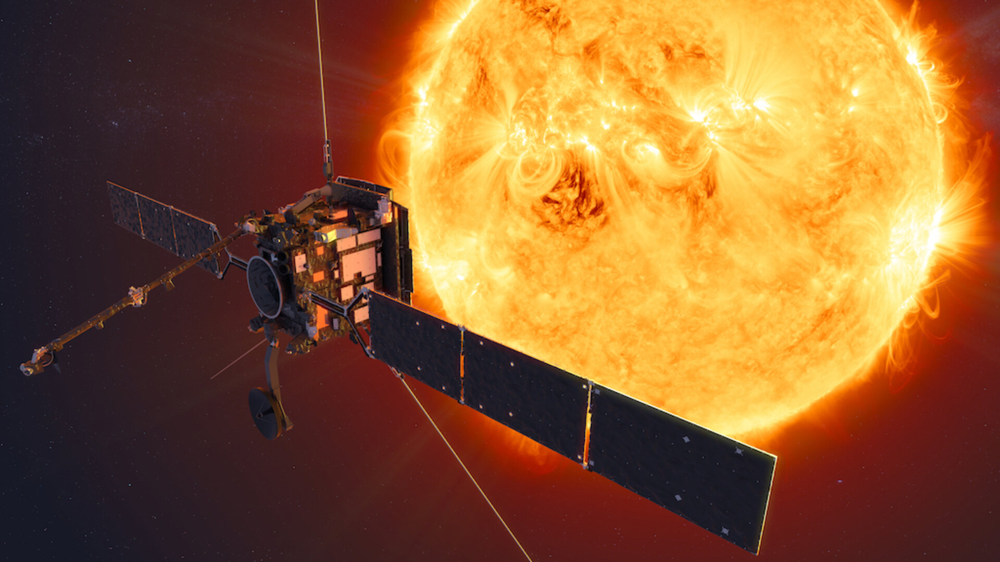
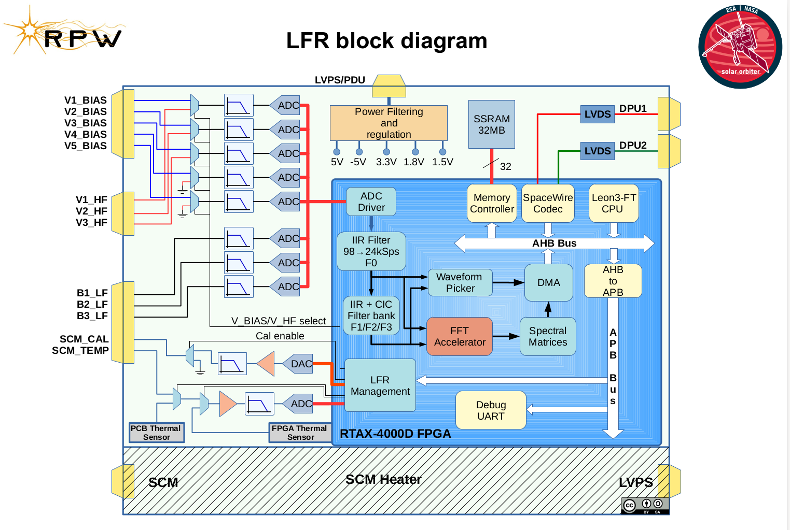
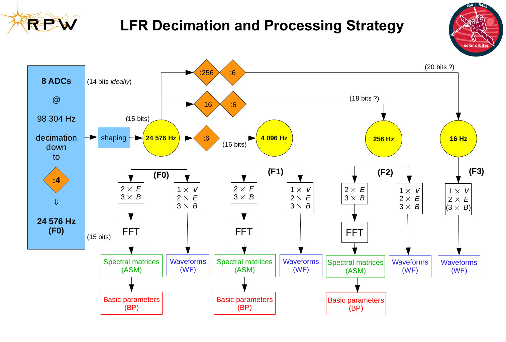

# LFR Flight Software

<div align="center">
    <br/><br/>
    
</div>

Welcome to the Low Frequency Receiver flight software repository for the [Solar Orbiter](https://www.esa.int/Science_Exploration/Space_Science/Solar_Orbiter) probe!

The Solar Orbiter mission, launched in February 2020, aims to study the Sun and its environment in unprecedented detail.
One of its key instruments is the Radio Plasma Wave instrument where the Low Frequency Receiver (LFR) is a subsystem, which is designed to measure electric and magnetic fields from quasi DC to 10 kHz.
The LFR provides crucial information about the solar wind and the Sun's magnetic field, which are important for understanding space weather and its effects on Earth.

This repository contains the flight software for the LFR instrument, which is responsible for controlling the instrument, acquiring data, and transmitting it to [RPW DPU](https://rpw.lesia.obspm.fr/rpw-instrument/).
The software has been developed by a team of experts in space instrumentation and software engineering, and has undergone rigorous testing and validation to ensure its reliability and performance in the harsh space environment.

## Quick Overview

The LFR flight software (FSW) runs on a **LEON3-FT CPU at 25 MHz** implemented in an RTAX-4000D FPGA, using **RTEMS 4.10** as its real-time operating system. It manages **22 concurrent tasks** that handle data acquisition, spectral analysis, telecommand processing, and telemetry transmission over SpaceWire.

The FPGA SoC handles the heavy computation (digital filtering, FFTs, spectral matrix generation) while the CPU performs spectral matrix averaging, basic parameter computation, calibration, and all communication.



### Frequency Channels

| Channel | Sampling Rate | Bandwidth |
|---------|--------------|-----------|
| f0 | 24576 Hz | DC -- 10 kHz |
| f1 | 4096 Hz | DC -- 1.7 kHz |
| f2 | 256 Hz | DC -- 100 Hz |
| f3 | 16 Hz | DC -- 6 Hz |

### Data Products

- **Waveform Snapshots (SWF)** -- time-domain samples of all 5 channels (B1, B2, B3, E1, E2)
- **Continuous Waveforms (CWF)** -- continuous data streams in burst/SBM modes
- **Spectral Matrices (ASM)** -- averaged 5x5 cross-spectral matrices at 128 frequency bins
- **Basic Parameters (BP1/BP2)** -- reduced spectral products (wave polarization, power spectral density, propagation direction)



### Operating Modes

| Mode | Description |
|------|-------------|
| **STANDBY** | No science acquisition (default at boot) |
| **NORMAL** | Nominal operations -- SWF, CWF3-light, BP1/BP2, ASM |
| **BURST** | High-rate continuous waveforms + BP at higher cadence |
| **SBM1** | Selective Burst Mode 1 -- CWF at f1 rate |
| **SBM2** | Selective Burst Mode 2 -- CWF at f2 rate |

## Architecture Documentation

For a comprehensive technical description of the software architecture, see **[ARCHITECTURE.md](ARCHITECTURE.md)**. It covers:

- Boot and initialization sequence
- RTEMS task architecture (all 22 tasks with priorities and interactions)
- Data acquisition and processing pipeline
- Spectral matrix averaging, calibration, and compression
- Basic parameter computation (BP1/BP2)
- Telecommand handling (all 16 TC subtypes)
- Telemetry generation and CCSDS packet types
- SpaceWire link management and recovery
- Ring buffer architecture
- Interference mitigation (PAS filtering, reaction wheel filtering)
- Memory-mapped hardware register map
- Key constants and default parameters

## Source Code Pointers

| Path | Description |
|------|-------------|
| [src/fsw_init.c](src/fsw_init.c) | Boot sequence, RTEMS task and queue creation |
| [src/fsw_spacewire.c](src/fsw_spacewire.c) | SpaceWire tasks (RECV, SEND, SPIQ, LINK) |
| [src/tc_tm/tc_handler.c](src/tc_tm/tc_handler.c) | Telecommand action dispatcher and handlers |
| [src/tc_tm/tc_acceptance.c](src/tc_tm/tc_acceptance.c) | TC validation (CRC, APID, length, subtype) |
| [src/hw/wf_handler.c](src/hw/wf_handler.c) | Waveform DMA ISR and waveform tasks |
| [src/processing/ASM/spectralmatrices.c](src/processing/ASM/spectralmatrices.c) | SM averaging, compression, and calibration |
| [src/processing/avf0_prc0.c](src/processing/avf0_prc0.c) | F0 averaging and processing tasks |
| [src/processing/calibration_matrices.c](src/processing/calibration_matrices.c) | Pre-computed calibration tables |
| [LFR_basic-parameters/basic_parameters.c](LFR_basic-parameters/basic_parameters.c) | BP1/BP2 computation from spectral matrices |
| [src/mitigations/PAS_filtering.c](src/mitigations/PAS_filtering.c) | Periodic acquisition scheme filter |
| [src/mitigations/reaction_wheel_filtering.c](src/mitigations/reaction_wheel_filtering.c) | Reaction wheel frequency bin masking |
| [header/lfr_common_headers/fsw_params.h](header/lfr_common_headers/fsw_params.h) | Master configuration (task priorities, modes, timing) |
| [header/hw/lfr_regs.h](header/hw/lfr_regs.h) | Memory-mapped register structures |

### Related Hardware

- RTL code: [VHD_Lib](https://github.com/jeandet/VHD_Lib)
- Board top: [LFR-FM.vhd](https://github.com/jeandet/VHD_Lib/blob/master/designs/SOLO_LFR_LFR-FM/LFR-FM.vhd)
- Custom DMA: [lpp_dma](https://github.com/jeandet/VHD_Lib/tree/master/lib/lpp/lpp_dma)

## Building

### Prerequisites

A Docker image with the complete build environment is available [here](https://github.com/jeandet/teamcity-docker-SolarOrbiter-LFR-agent/tree/master).

Requirements:
- [Meson](https://mesonbuild.com/) build system
- RTEMS 4.10 SPARC cross-compiler toolchain at `/opt/rtems-4.10/`
- ninja build backend

### Cross-build (flight binary)

```bash
meson setup -Dlpp-destid=false -Doptimization=s --cross-file=sparc-cross.ini . build
cd build
ninja
```

This produces:
- `fsw` -- ELF binary for LEON3
- `RpwLfrApp_XXXX_text_rev-3-3-0-16.srec` -- text section (for upload to LFR)
- `RpwLfrApp_XXXX_data_rev-3-3-0-16.srec` -- data section
- `check_b2bst.log` -- LEON3-FT errata scan verification

### Native build (tests and benchmarks)

```bash
meson setup . build-native
cd build-native
ninja test
```

### Build Options

| Option | Default | Description |
|--------|---------|-------------|
| `SW_VERSION_N1..N4` | `3.3.0.16` | Software version embedded in binary |
| `fix-b2bst` | `true` | Mitigate LEON3-FT stale cache errata |
| `lpp-destid` | `false` | Use LPP lab DPU destination ID |
| `with-gcov` | `false` | Enable code coverage |
| `enable-printf` | `false` | Enable debug console output |
| `enable-boot-messages` | `false` | Enable boot messages |
| `enable-cpu-usage-report` | `false` | Print CPU usage statistics |
| `enable-stack-report` | `false` | Enable RTEMS stack checker |

## Version History

| Version | Period | Notes |
|---------|--------|-------|
| 3.2.0.24 | Launch -- 14/03/2023 | Baseline flight software |
| 3.3.0.16 | 14/03/2023 -- present | Bug fixes, calibration matrices for antenna misalignment correction |

## License

This software is licensed under the [GNU General Public License v2.0](https://www.gnu.org/licenses/gpl-2.0.html).

Copyright (C) 2012-2021, Plasma Physics Laboratory (LPP) - CNRS

Authors: Paul Leroy, Alexis Jeandet, Thomas Chust

Contact: alexis.jeandet@lpp.polytechnique.fr
